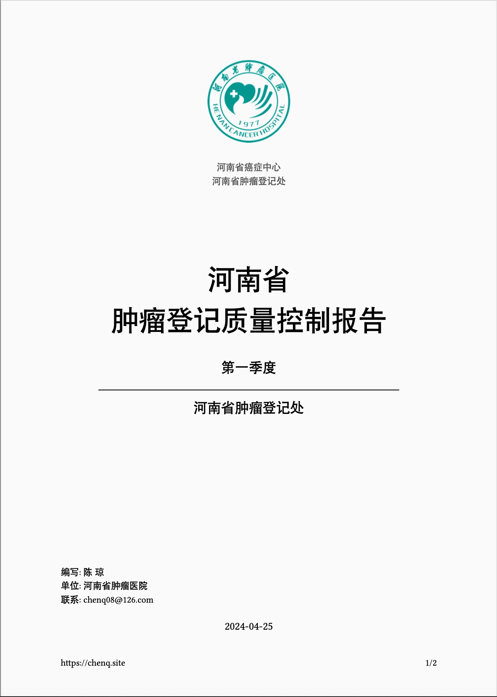

# Typst Qcreport Format

## Installing

```bash
quarto use template gigu003/typst-templates/qcreport
```

This will install the format extension and create an example qmd file
that you can use as a starting place for your document.

## Using

```bash
---
title: This is a report title
subtitle: "第一季度"
date: today
authors:
  - name: 陈 琼
    email: chenq08@126.com
    affiliation: "河南省肿瘤医院"
format:
  qcreport-typst:
    registry: "河南省肿瘤登记处"
    header: "质控报告"
    footer: "https://chenq.site"
    section-numbering: "1."
    mainfont: "song"
    toc: true
---
```

This is what a poster with the options specified above might look like:



